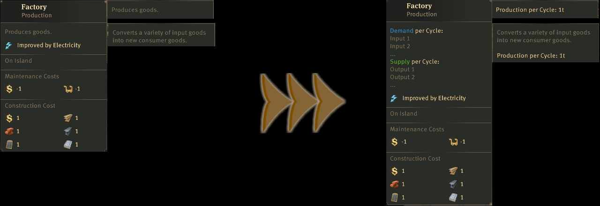

# Shared Anno 1800 Mods

Shared mods from Kurilas's Collection.

## Shared General Modules

Contains adaptations of the UI elements for modules.

Instead of agricultural terms and icons, more general ones are used (as far as possible). 

### Use General Modules

Add the following dependencies to your `modinfo.json`:
```json
"ModDependencies": [
  ""
]
```

## Shared General Permits

Contains adjustments to the UI elements of the building permits.

Instead of only Great Eastern and Advanced Pier, they are now designed for ships/harbour structures and industrial buildings.

### Use General Permits

Add the following dependencies to your `modinfo.json`:
```json
"ModDependencies": [
  ""
]
```

## Shared Info Description Parts

Contains text modules for an extended InfoDescription

There are also some minor changes to vanilla texts.



### Use Info Description Parts in your Mod

For more information on the use of extended InfoDescription, read the mod's readme.

Add the following dependencies to your `modinfo.json`:
```json
"ModDependencies": [
  ""
]
```

## Shared Products

Shared products from Kurila, Jakob and Lrds42.

These products are planned as additional productions and have little influence on the vanilla game.

Contains products with definition, icon and Docklands information.

Icon | GUID | Name |
---|---|---|
 | 1404420032 | Apples |
 | 1500301073 | Coloured Tiles |
 | 1500300040 | Liqueur |
 | 1500300060 | Sandwiches |
 | 1500300020 | Smoked Fish |
 | 1500010150 | Wooden Jewelry |

## Shared Products Extended 

Shared extended products from Kurila and Lrds42.

These products are planned as intermediate stages to existing production chains and have a greater impact on the vanilla game.

Contains products with definition, icon and Docklands information.

Icon | GUID | Name |
---|---|---|
 | 1404422300 | Cattle |
 | 1404420030 | Cherries |
 | 1500020000 | Wool Fabric |
 | 1500020010 | Sewing Thread |
 | 1500300000 | Barrels |

### Use Products in your Mod

Add one/all of the following dependencies to your `modinfo.json`:
```json
"ModDependencies": [
  "",
  ""
]
```

Products are not unlocked automatically, you need to unlock them yourself, if you use the products.

## Shared Recipe Buildings
This mod is a collection of single mods that convert vanilla buildings to recipe buildings.

This way, modders who plan new recipes can all build on the same base and there are no compatibility problems.

I do not recommend using the collection as a whole, otherwise all buildings will be changed regardless of whether you are planning a new recipe for just one.

Only include the Sub-Mod Building for which you are planning recipes.

### Converted buildings.

- Lumberjack


## How to Build

### Build with Visual Studio Code plugin

The mods are made with the [Modding Tools for Anno](https://marketplace.visualstudio.com/items?itemName=JakobHarder.anno-modding-tools) extension for [VS Code](https://code.visualstudio.com/).

Make sure to set `annoMods` settings.

Install the plugin, open a mod folder and press `F1` and choose `Build Anno Mod` or right click on a `modinfo.json` file.

### Build with Node.js

Run the following commands:

```
npm install .
npm run build
npm run package
```