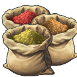

# Shared Anno 1800 Mods

Shared mods from Kurilas's Collection.

## Shared General Modules

Contains adjustments of the UI elements for modules.

Instead of agricultural terms and icons, more general ones are used (as far as possible).

### Use General Modules

Add the following dependencies to your `modinfo.json`:

```json
"ModDependencies": [
  "https://github.com/Qurila/shared-mods/releases/download/v7/shared_general_modules_kurila.zip"
]
```

## Shared General Permits

Contains adjustments to the UI elements of the building permits.

Instead of only Great Eastern and Advanced Pier, they are now designed for ships/harbour structures and industrial buildings.

### Use General Permits

Add the following dependencies to your `modinfo.json`:

```json
"ModDependencies": [
  "https://github.com/Qurila/shared-mods/releases/download/v7/shared_general_permits_kurila.zip"
]
```

## Shared UI Change

This mod makes it possible to switch between two different UIs on buildings ingame.

- An example is found in the assets.xml

It should be noted that during the change selected buildings must be selected again to see the new UI.

### Use UI Change in your Mod

Add following dependencies to your `modinfo.json`:

```json
"ModDependencies": [
  "https://github.com/Qurila/shared-mods/releases/download/v7/shared_ui_change_kurila.zip"
]
```

## Shared Combi Allocation

Contains a new allocation.
This means that the same item can be used in different buildings.

For example, an item can be used in both the Arctic Lodge and the Trade Union.

### Use Combi Allocation

Add the following dependencies to your `modinfo.json`:

```json
"ModDependencies": [
  "https://github.com/Qurila/shared-mods/releases/download/v7/shared_combi_allocations_kurila.zip"
]
```

## Shared Range Distinction

Contains a change to the "Range" display of items.

These now distinguish between Puplic Services and Institutions (Fire/Police/Hospital)

### Use Range Distinction

Add the following dependencies to your `modinfo.json`:

```json
"ModDependencies": [
  "https://github.com/Qurila/shared-mods/releases/download/v7/shared_range_distinction_kurila.zip"
]
```

## Shared Scroll Hint

Contains a hint for the UI of Residences that indicates if there are more Needs than the UI directly displays.

### Use Scroll Hint

Add the following dependencies to your `modinfo.json`:

```json
"ModDependencies": [
  "https://github.com/Qurila/shared-mods/releases/download/v7/shared_scroll_hint_kurila.zip"
]
```

## Shared Info Parts

Contains text modules for an extended InfoDescription

### Use Info Parts in your Mod

For more information on the use of extended InfoDescription, read the mod's readme.
<https://github.com/Qurila/shared-mods/tree/main/%5BShared%5D%20Info%20Parts%20(Kurila)>

Add the following dependencies to your `modinfo.json`:

```json
"ModDependencies": [
  "https://github.com/Qurila/shared-mods/releases/download/v7/shared_info_parts_kurila.zip"
]
```

## Shared Products

Shared products from Kurila, Jakob and Lrds42.

These products are planned as additional productions and have little influence on the vanilla game.

Contains products with definition, icon and Docklands information.

Icon | GUID | Name |
---|---|---|
 | 1404420032 | Apples |
 | 1500301073 | Coloured Tiles |
 | 1500300040 | Liqueur |
 | 1500300060 | Sandwiches |
 | 1500300020 | Smoked Fish |
 | 1500010150 | Wooden Jewelry |

## Shared Products Extended

Shared extended products from Kurila and Lrds42.

These products are planned as intermediate stages to existing production chains and have a greater impact on the vanilla game.

Contains products with definition, icon and Docklands information.

Icon | GUID | Name |
---|---|---|
 | 1404422300 | Cattle |
 | 1404420030 | Cherries |
 | 1500020000 | Wool Fabric |
 | 1500020010 | Sewing Thread |
 | 1500300000 | Barrels |
 | 1500301150 | Wanza Wood |
 | 1500301151 | Cherry Timber |
 | 1500301148 | Spice Powder |

### Use Products in your Mod

Add one/all of the following dependencies to your `modinfo.json`:

```json
"ModDependencies": [
  "https://github.com/Qurila/shared-mods/releases/download/v7/shared_products_kurila.zip",
  "https://github.com/Qurila/shared-mods/releases/download/v7/shared_products_extended_kurila.zip"
]
```

Products are not unlocked automatically, you need to unlock them yourself, if you use the products.

## Shared Recipe Buildings

This mods convert vanilla buildings to recipe buildings.

This way, modders who plan new recipes can all build on the same base and there are no compatibility problems.

### Converted buildings

- Lumberjack
- Marquetry Workshops
- Sawmills (Inlcuding Mod Buildings)
- Schnapps Distilleries (Inlcuding Mod Buildings)
- (Beer)Breweries
- Wool Farms (Sheep and Alpaca)

### Use Recipe Buildings in your Mod

Add the desired dependencies to your `modinfo.json`:

```json
"ModDependencies": [
  "https://github.com/Qurila/shared-mods/releases/download/v7/shared_lumberjack_kurila.zip"

  "https://github.com/Qurila/shared-mods/releases/download/v7/shared_sawmill_kurila.zip"
  "https://github.com/Qurila/shared-mods/releases/download/v7/shared_sawmill_river_kurila.zip"
  "https://github.com/Qurila/shared-mods/releases/download/v7/shared_sawmill_industrial_kurila.zip"

  "https://github.com/Qurila/shared-mods/releases/download/v7/shared_marquetry_workshop_kurila.zip"

  "https://github.com/Qurila/shared-mods/releases/download/v7/shared_beer_brewery_kurila.zip"

  "https://github.com/Qurila/shared-mods/releases/download/v7/shared_schnapps_kurila.zip"
  "https://github.com/Qurila/shared-mods/releases/download/v7/shared_schnapps_industrial_kurila.zip"

  "https://github.com/Qurila/shared-mods/releases/download/v7/shared_wool_farms_kurila.zip"
]
```

## Shared Cherry Sawmill

This mod makes it possible to produce Cherry Timber from Cherry Wood in Sawmills that have been converted into recipe buildings.

### Use Cherry Sawmill in your Mod

Add the following dependencies to your `modinfo.json`:

```json
"ModDependencies": [
  "https://github.com/Qurila/shared-mods/releases/download/v7/shared_cherry_sawmill_kurila.zip",
  "https://github.com/Qurila/shared-mods/releases/download/v7/shared_products_extended_kurila.zip",
  "https://github.com/Qurila/shared-mods/releases/download/v7/shared_sawmill_kurila.zip",
  "https://github.com/Qurila/shared-mods/releases/download/v7/shared_sawmill_river_kurila.zip",
  "https://github.com/Qurila/shared-mods/releases/download/v7/shared_sawmill_industrial_kurila.zip"
]
```

## Shared Wanza Sawmill

This mod makes it possible to produce Wanza Timber from Wanza Wood in a new Enbesa Sawmill.

### Use Wanza Sawmill in your Mod

Add the following dependencies to your `modinfo.json`:

```json
"ModDependencies": [
  "https://github.com/Qurila/shared-mods/releases/download/v7/shared_wanza_sawmill_kurila.zip",
  "https://github.com/Qurila/shared-mods/releases/download/v7/shared_products_extended_kurila.zip"
]
```

## Shared Clay Works

This mod provides a farmer-level Clay Sink as an early source of Clay and an ingineer-level Clay Mine as a late source of Clay.

### Use Clay Works in your Mod

Add the following dependencies to your `modinfo.json`:

```json
"ModDependencies": [
  "https://github.com/Qurila/shared-mods/releases/download/v7/shared_clay_works_kurila.zip"
]
```

## Shared Herb Garden

This mod provides a Herb Garden for the Old World

### Use Herb Garden

Add the following dependencies to your `modinfo.json`:

```json
"ModDependencies": [
  "https://github.com/Qurila/shared-mods/releases/download/v7/shared_herb_garden_kurila.zip"
]
```

## Shared Advanced Lumberjack

This mod provides an ingineer-level Advanced Lumberjack as a late source of Wood.

### Use Lumberjack

Add the following dependencies to your `modinfo.json`:

```json
"ModDependencies": [
  "https://github.com/Qurila/shared-mods/releases/download/v7/shared_advanced_lumberjack_kurila.zip"
]
```

## Shared Salt Works

This mod provides a worker/jornalero-level Salt Works for the Old/New World and an ingineer-level Advanced Salt Works for the Old World

### Use Salt Works

Add the following dependencies to your `modinfo.json`:

```json
"ModDependencies": [
  "https://github.com/Qurila/shared-mods/releases/download/v7/shared_salt_works_kurila.zip"
]
```

## Shared Spice Mill

This mod provides a Spice Mill for Enbesa. Its produce the new good "Spice Powder"

### Use Spice Mill

Add the following dependencies to your `modinfo.json`:

```json
"ModDependencies": [
  "https://github.com/Qurila/shared-mods/releases/download/v7/shared_spice_mill_kurila.zip",
  "https://github.com/Qurila/shared-mods/releases/download/v7/shared_products_extended_kurila.zip"
]
```

## How to Build

### Build with Visual Studio Code plugin

The mods are made with the [Modding Tools for Anno](https://marketplace.visualstudio.com/items?itemName=JakobHarder.anno-modding-tools) extension for [VS Code](https://code.visualstudio.com/).

Make sure to set `annoMods` settings.

Install the plugin, open a mod folder and press `F1` and choose `Build Anno Mod` or right click on a `modinfo.json` file.

### Build with Node.js

Run the following commands:

```xml
npm install .
npm run build
npm run package
```
